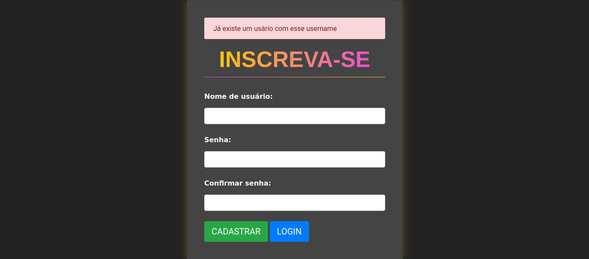
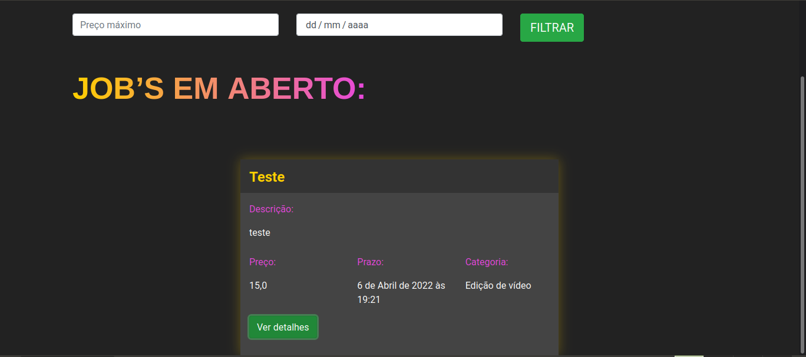

<div align="center">
  <h1>💼 Jobs</h1>
</div>

<br>

<div align="center">
    <a href="#sobre">Sobre</a> | <a href="#tecnologias">Tecnologias</a> | <a href="#run">Rodando o projeto</a>
</div>

<a id="sobre"></a>

O projeto jobs visa ser um lugar de acesso a vagas de pequenos trabalhos onde a pessoa pode ser recompensado por realizar ediçoes de videos e dentre outras coisas. :)_

Tela de Login
<div align="center">
    
</div>

Home Page
<div align="center">
    
</div>

<a id="tecnologias"></a>

## :computer: Tecnologias

O projeto foi desenvolvido usando as tecnologias:

<div align="center">
 	
  
  
  
  
  
</div>

<a id="run"></a>

## :running: Rodando o projeto

### 💻 Pré-requisitos

Antes de começar, verifique se você atendeu aos seguintes requisitos:

- Você instalou a versão mais recente de `< Docker/ Python>`
- Você tem uma máquina `< Windows / Linux / Mac >`.
- Você possui um `< Editor de código ou IDE / Gerenciador de banco de dados >`.

## ☕ Pequeno tutorial

Preencha o arquivo `.env.example` com as informações cobradas e depois renomeie para `.env`.

```env
# DJANGO

# DEBUG = 1 or 0
DEBUG=
SECRET_KEY=

# DJANGO_ALLOWED_HOSTS = localhost 127.0.0.1 [::1] ...
DJANGO_ALLOWED_HOSTS=

# POSTGRES
POSTGRES_DB=
POSTGRES_USER=
POSTGRES_PASSWORD=

# PGADMIN
PGADMIN_DEFAULT_EMAIL=
PGADMIN_DEFAULT_PASSWORD=
```

## Se lembre de ter o Docker :dolphin:

### UM comando só:

```bash
$ docker-compose up
```

### Manualmente:

Crie um banco de dados com o docker-compose

```bash
$ docker-compose up db
```

Agora realize as migrações necessárias:

```bash
$ python manage.py makemigrations && python manage.py migrate
```

E por fim, rode o aplicativo:

```bash
$ python manage.py runserver
```

#### _Sinta-se livre para colaborar, toda ajuda é bem vinda ;)_

<br/>
