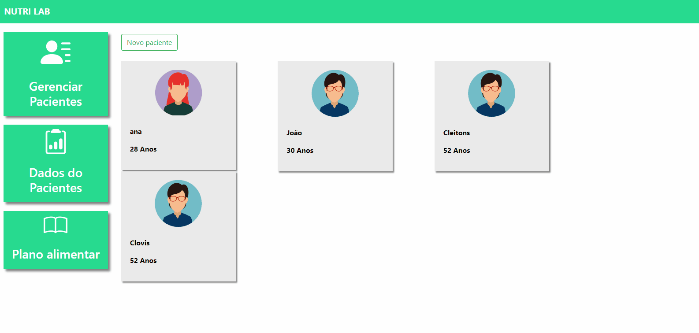
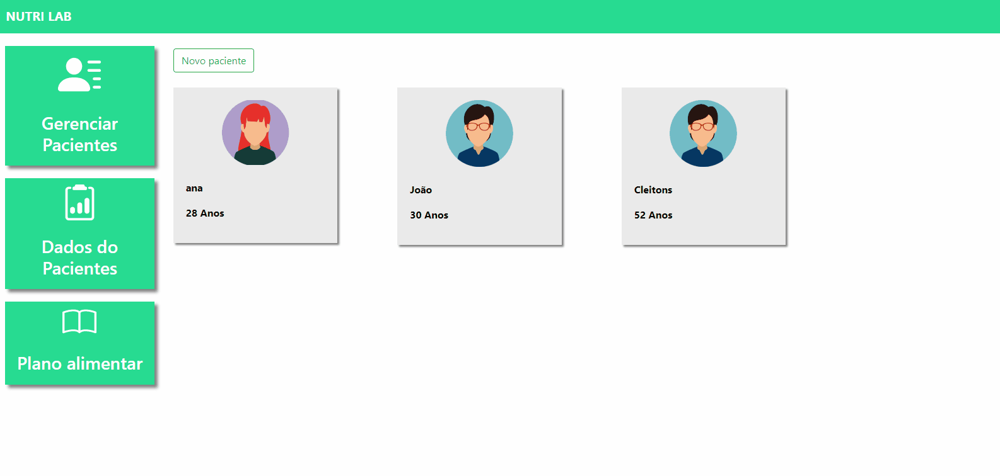

<div align="center">
  <h1>🏋️ Nutri-Lab</h1>
</div>

<br>

 
 

  


<div align="center">
    <a href="#sobre">Sobre</a> | <a href="#tecnologias">Tecnologias</a> | <a href="#run">Rodando o projeto</a>
</div>

<a id="sobre"></a>

## 🏋️ Sobre o projeto Nutri-Lab

O projeto **Nutri-Lab** visa centralizar um bjetivo, que é uma aplicação para nutricionistas gerenciarem seus pacientes.

<div align="center">
    
    
</div>

<a id="tecnologias"></a> 

## :computer: Tecnologias

O backend da aplicação foi desenvolvido utilizando as tecnologias:

- [Django](https://www.djangoproject.com/)
- [Docker](https://www.docker.com)
- [Postgres](https://www.postgresql.org/)

<a id="run"></a>

## :running: Rodando o projeto

### Rodando através da fonte:

### 💻 Pré-requisitos

Antes de começar, verifique se você atendeu aos seguintes requisitos:

- Você instalou a versão mais recente de `< Docker/ Python>`
- Você tem uma máquina `< Windows / Linux / Mac >`.
- Você possui um `< editor de código / Gerenciador de banco de dados >`.

## 🚀 Instalando

```bash
$ pip install -r requirements
```

## ☕ Rodando

Preencha o arquivo `.env.example` com as informações cobradas e depois renomeie para `.env`.

```env
## APP

SECRET_KEY=
DEBUG=
HOSTS=

# POSTGRES
POSTGRES_DB=
POSTGRES_USER=
POSTGRES_PASSWORD=

# PGADMIN
PGADMIN_DEFAULT_EMAIL=
PGADMIN_DEFAULT_PASSWORD=
```

Crie um banco de dados com o docker-compose

```bash
$ docker-compose up db
```

Agora realize as migrações necessárias:

```bash
$ python manage.py makemigrations && python manage.py migrate
```

E por fim, rode o aplicativo:

```bash
$ python manage.py runserver
```

#### _Sinta-se livre para colaborar, toda ajuda é bem vinda ;)_

<br/>
